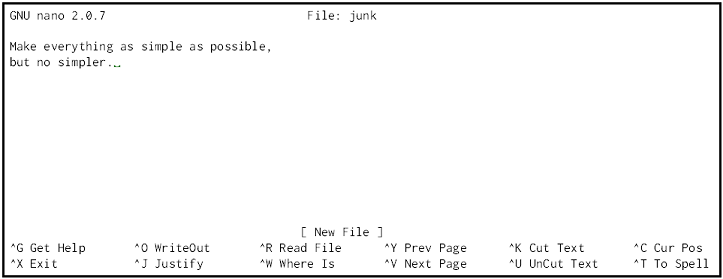

#### Objectives
*   Create a directory hierarchy that matches a given diagram.
*   Create files in that hierarchy using an editor or by copying and renaming existing files.
*   Display the contents of a directory using the command line.
*   Delete specified files and/or directories.

We now know how to explore files and directories,
but how do we create them in the first place?
Let's go back to Vlad's home directory,
`/users/vlad`,
and use `ls -F` to see what it contains:

<pre class="in">$ pwd</pre>
<pre class="out">/users/vlad</pre>
<pre class="in">$ ls -F</pre>
<pre class="out">bin/         data/     mail/      music/
notes.txt    papers/   pizza.cfg  solar/
solar.pdf    swc/</pre>

Let's create a new directory called `thesis` using the command `mkdir thesis`
(which has no output):

<pre class="in">$ mkdir thesis</pre>

As you might (or might not) guess from its name,
`mkdir` means "make directory".
Since `thesis` is a relative path
(i.e., doesn't have a leading slash),
the new directory is made below the current working directory:

<pre class="in">
$ ls -F
</pre>
<pre class="out">
bin/         data/     mail/      music/
notes.txt    papers/   pizza.cfg  solar/
solar.pdf    swc/      thesis/
</pre>

However, there's nothing in it yet:

<pre class="in">
$ ls -F thesis
</pre>

Let's change our working directory to `thesis` using `cd`,
then run a text editor called Nano to create a file called `draft.txt`:

<pre class="in">
$ cd thesis
$ nano draft.txt
</pre>

> #### Which Editor?
> 
> When we say, "`nano` is a text editor," we really do mean "text": it can
> only work with plain character data, not tables, images, or any other
> human-friendly media. We use it in examples because almost anyone can
> drive it anywhere without training, but please use something more
> powerful for real work. On Unix systems (such as Linux and Mac OS X),
> many programmers use [Emacs](http://www.gnu.org/software/emacs/) or
> [Vim](http://www.vim.org/) (both of which are completely unintuitive,
> even by Unix standards), or a graphical editor such as
> [Gedit](http://projects.gnome.org/gedit/). On Windows, you may wish to
> use [Notepad++](http://notepad-plus-plus.org/).
> 
> No matter what editor you use, you will need to know where it searches
> for and saves files. If you start it from the shell, it will (probably)
> use your current working directory as its default location. If you use
> your computer's start menu, it may want to save files in your desktop or
> documents directory instead. You can change this by navigating to
> another directory the first time you "Save As..."

Let's type in a few lines of text,
then use Control-O to write our data to disk:

Once our file is saved,
we can use Control-X to quit the editor and return to the shell.
(Unix documentation often uses the shorthand `^A` to mean "control-A".)
`nano` doesn't leave any output on the screen after it exits,
but `ls` now shows that we have created a file called `draft.txt`:

<pre class="in">
$ ls
</pre>
<pre class="out">
draft.txt
</pre>

We can run `ls` with the `-s` flag (for "size")
to show us how large `draft.txt` is:

<pre class="in">
$ ls -s
</pre>
<pre class="out">
   1  draft.txt
</pre>

Unfortunately,
Unix reports sizes in [disk blocks](../../gloss.html#disk-block) by default,
which might be the least helpful default possible.
If we add the `-h` flag,
`ls` switches to more human-friendly units:

<pre class="in">
$ ls -s -h
</pre>
<pre class="out">
 512  draft.txt
</pre>

Here, 512 is the number of bytes in the file.
This is more than we actually typed in because the smallest unit of storage on the disk
is typically a block of 512 bytes.

Let's tidy up by running `rm draft.txt`:

<pre class="in">
$ rm draft.txt
</pre>

This command removes files ("rm" is short for "remove").
If we run `ls` again,
its output is empty once more,
which tells us that our file is gone:

<pre class="in">
$ ls
</pre>

> #### Deleting Is Forever
> 
> Unix doesn't have a trash bin: when we delete files, they are unhooked
> from the file system so that their storage space on disk can be
> recycled. Tools for finding and recovering deleted files do exist, but
> there's no guarantee they'll work in any particular situation, since the
> computer may recycle the file's disk space right away.

Let's re-create that file
and then move up one directory to `/users/vlad` using `cd ..`:

<pre class="in">
$ pwd
</pre>
<pre class="out">
/users/vlad/thesis
</pre>
<pre class="in">
$ nano draft.txt
$ ls
</pre>
<pre class="out">
draft.txt
</pre>
<pre class="in">
$ cd ..
</pre>

If we try to remove the entire `thesis` directory using `rm thesis`,
we get an error message:

<pre class="in">
$ rm thesis
</pre>
<pre class="err">
rm: cannot remove `thesis': Is a directory
</pre>

This happens because `rm` only works on files, not directories.
The right command is `rmdir`,
which is short for "remove directory".
It doesn't work yet either, though,
because the directory we're trying to remove isn't empty:

<pre class="in">
$ rmdir thesis
</pre>
<pre class="err">
rmdir: failed to remove `thesis': Directory not empty
</pre>

This little safety feature can save you a lot of grief,
particularly if you are a bad typist.
To really get rid of `thesis` we must first delete the file `draft.txt`:

<pre class="in">
$ rm thesis/draft.txt
</pre>

The directory is now empty, so `rmdir` can delete it:

<pre class="in">
$ rmdir thesis
</pre>

> #### With Great Power Comes Great Responsibility
> 
> Removing the files in a directory just so that we can remove the
> directory quickly becomes tedious. Instead, we can use `rm` with the
> `-r` flag (which stands for "recursive"):
> 
> ~~~
> $ rm -r thesis
> ~~~
> 
> This removes everything in the directory, then the directory itself. If
> the directory contains sub-directories, `rm -r` does the same thing to
> them, and so on. It's very handy, but can do a lot of damage if used
> without care.

Let's create that directory and file one more time.
(Note that this time we're running `nano` with the path `thesis/draft.txt`,
rather than going into the `thesis` directory and running `nano` on `draft.txt` there.)

<pre class="in">
$ pwd
</pre>
<pre class="out">
/users/vlad
</pre>
<pre class="in">
$ mkdir thesis
</pre>
<pre class="in">
$ nano thesis/draft.txt
$ ls thesis
</pre>
<pre class="out">
draft.txt
</pre>

`draft.txt` isn't a particularly informative name,
so let's change the file's name using `mv`,
which is short for "move":

<pre class="in">
$ mv thesis/draft.txt thesis/quotes.txt
</pre>

The first parameter tells `mv` what we're "moving",
while the second is where it's to go.
In this case,
we're moving `thesis/draft.txt` to `thesis/quotes.txt`,
which has the same effect as renaming the file.
Sure enough,
`ls` shows us that `thesis` now contains one file called `quotes.txt`:

<pre class="in">
$ ls thesis
</pre>
<pre class="out">
quotes.txt
</pre>

Just for the sake of inconsistency,
`mv` also works on directories&mdash;there is no separate `mvdir` command.

Let's move `quotes.txt` into the current working directory.
We use `mv` once again,
but this time we'll just use the name of a directory as the second parameter
to tell `mv` that we want to keep the filename,
but put the file somewhere new.
(This is why the command is called "move".)
In this case,
the directory name we use is the special directory name `.` that we mentioned earlier.

<pre class="in">
$ mv thesis/quotes.txt .
</pre>

The effect is to move the file from the directory it was in to the current working directory.
`ls` now shows us that `thesis` is empty:

<pre class="in">
$ ls thesis
</pre>

Further,
`ls` with a filename or directory name as a parameter only lists that file or directory.
We can use this to see that `quotes.txt` is still in our current directory:

<pre class="in">
$ ls quotes.txt
</pre>
<pre class="out">
quotes.txt
</pre>

The `cp` command works very much like `mv`,
except it copies a file instead of moving it.
We can check that it did the right thing using `ls`
with two paths as parameters&mdash;like most Unix commands,
`ls` can be given thousands of paths at once:

<pre class="in">
$ cp quotes.txt thesis/quotations.txt
$ ls quotes.txt thesis/quotations.txt
</pre>
<pre class="out">
quotes.txt   thesis/quotations.txt
</pre>

To prove that we made a copy,
let's delete the `quotes.txt` file in the current directory
and then run that same `ls` again.
This time it tells us that it can't find `quotes.txt` in the current directory,
but it does find the copy in `thesis` that we didn't delete:

<pre class="in">
$ ls quotes.txt thesis/quotations.txt
</pre>
<pre class="err">
ls: cannot access quotes.txt: No such file or directory
thesis/quotations.txt
</pre>

> #### Another Useful Abbreviation
> 
> The shell interprets the character `~` (tilde) at the start of a path to
> mean "the current user's home directory". For example, if Vlad's home
> directory is `/home/vlad`, then `~/data` is equivalent to
> `/home/vlad/data`. This only works if it is the first character in the
> path: `here/there/~/elsewhere` is *not* `/home/vlad/elsewhere`.

#### Key Points
*   Unix documentation uses '^A' to mean "control-A".
*   The shell does not have a trash bin: once something is deleted, it's really gone.
*   Nano is a very simple text editor&mdash;please use something else for real work.

#### Challenges

1.  What is the output of the closing `ls` command in the sequence shown below?

    ~~~
    $ pwd
    /home/thing/data
    $ ls
    proteins.dat
    $ mkdir recombine
    $ mv proteins.dat recombine
    $ cp recombine/proteins.dat ../proteins-saved.dat
    $ ls
    ~~~

2.  Suppose that:

    ~~~
    $ ls -F
    analyzed/  fructose.dat    raw/   sucrose.dat
    ~~~

    What command(s) could you run so that the commands below will produce the output shown?

    ~~~
    $ ls
    analyzed   raw
    $ ls analyzed
    fructose.dat    sucrose.dat
    ~~~

3.  What does `cp` do when given several filenames and a directory name, as in:

    ~~~
    $ mkdir backup
    $ cp thesis/citations.txt thesis/quotations.txt backup
    ~~~

    What does `cp` do when given three or more filenames, as in:

    ~~~
    $ ls -F
    intro.txt    methods.txt    survey.txt
    $ cp intro.txt methods.txt survey.txt
    ~~~

    Why do you think `cp`'s behavior is different from `mv`'s?

4.  The command `ls -R` lists the contents of directories recursively,
    i.e., lists their sub-directories, sub-sub-directories, and so on
    in alphabetical order at each level.
    The command `ls -t` lists things by time of last change,
    with most recently changed files or directories first.
    In what order does `ls -R -t` display things?

