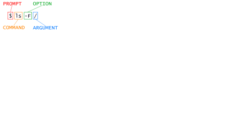

::::::::::::::::::::::::::::::::::::::: objectives

- Explain the similarities and differences between a file and a directory.
- Translate an absolute path into a relative path and vice versa.
- Construct absolute and relative paths that identify specific files and directories.
- Use options and arguments to change the behaviour of a shell command.
- Demonstrate the use of tab completion and explain its advantages.

::::::::::::::::::::::::::::::::::::::::::::::::::

:::::::::::::::::::::::::::::::::::::::: questions

- How can I move around on my computer?
- How can I see what files and directories I have?
- How can I specify the location of a file or directory on my computer?

::::::::::::::::::::::::::::::::::::::::::::::::::

:::::::::::::::::::::::::::::::::::::::: instructor

Introducing and navigating the filesystem in the shell
(covered in [Navigating Files and Directories](02-filedir.md) section)
can be confusing. You may have both terminal and GUI file explorer
open side by side so learners can see the content and file
structure while they're using terminal to navigate the system.

::::::::::::::::::::::::::::::::::::::::::::::::::

The part of the operating system responsible for managing files and directories
is called the **file system**.
It organizes our data into files,
which hold information,
and directories (also called 'folders'),
which hold files or other directories.

Several commands are frequently used to create, inspect, rename, and delete files and directories.
To start exploring them, we'll go to our open shell window.

First, let's find out where we are by running a command called `pwd`
(which stands for 'print working directory'). Directories are like *places* — at any time
while we are using the shell, we are in exactly one place called
our **current working directory**. Commands mostly read and write files in the
current working directory, i.e. 'here', so knowing where you are before running
a command is important. `pwd` shows you where you are:

```bash
$ pwd
```

```output
/Users/nelle
```

Here,
the computer's response is `/Users/nelle`,
which is Nelle's **home directory**:

:::::::::::::::::::::::::::::::::::::::::  callout

## Home Directory Variation

The home directory path will look different on different operating systems.
On Linux, it may look like `/home/nelle`,
and on Windows, it will be similar to `C:\Documents and Settings\nelle` or
`C:\Users\nelle`.
(Note that it may look slightly different for different versions of Windows.)
In future examples, we've used Mac output as the default - Linux and Windows
output may differ slightly but should be generally similar.

We will also assume that your `pwd` command returns your user's home directory.
If `pwd` returns something different, you may need to navigate there using `cd`
or some commands in this lesson will not work as written.
See [Exploring Other Directories](#exploring-other-directories) for more details
on the `cd` command.


::::::::::::::::::::::::::::::::::::::::::::::::::

To understand what a 'home directory' is,
let's have a look at how the file system as a whole is organized.  For the
sake of this example, we'll be
illustrating the filesystem on our scientist Nelle's computer.  After this
illustration, you'll be learning commands to explore your own filesystem,
which will be constructed in a similar way, but not be exactly identical.

On Nelle's computer, the filesystem looks like this:

{alt='The file system is made up of a root directory that contains sub-directories titled bin, data, users, and tmp'}

The filesystem looks like an upside down tree. 
The topmost directory  is the **root directory**
that holds everything else.
We refer to it using a slash character, `/`, on its own;
this character is the leading slash in `/Users/nelle`.

Inside that directory are several other directories:
`bin` (which is where some built-in programs are stored),
`data` (for miscellaneous data files),
`Users` (where users' personal directories are located),
`tmp` (for temporary files that don't need to be stored long-term),
and so on.

We know that our current working directory `/Users/nelle` is stored inside `/Users`
because `/Users` is the first part of its name.
Similarly,
we know that `/Users` is stored inside the root directory `/`
because its name begins with `/`.

:::::::::::::::::::::::::::::::::::::::::  callout

## Slashes

Notice that there are two meanings for the `/` character.
When it appears at the front of a file or directory name,
it refers to the root directory. When it appears *inside* a path,
it's just a separator.


::::::::::::::::::::::::::::::::::::::::::::::::::

Underneath `/Users`,
we find one directory for each user with an account on Nelle's machine,
her colleagues *imhotep* and *larry*.

{alt='Like other directories, home directories are sub-directories underneath "/Users" like "/Users/imhotep", "/Users/larry" or"/Users/nelle"'}

The user *imhotep*'s files are stored in `/Users/imhotep`,
user *larry*'s in `/Users/larry`,
and Nelle's in `/Users/nelle`. Nelle is the user in our
examples here; therefore, we get `/Users/nelle` as our home directory.
Typically, when you open a new command prompt, you will be in
your home directory to start.

Now let's learn the command that will let us see the contents of our
own filesystem.  We can see what's in our home directory by running `ls`:

```bash
$ ls
```

```output
Applications Documents    Library      Music        Public
Desktop      Downloads    Movies       Pictures
```

(Again, your results may be slightly different depending on your operating
system and how you have customized your filesystem.)

`ls` prints the names of the files and directories in the current directory.
We can make its output more comprehensible by using the `-F` **option**
which tells `ls` to classify the output
by adding a marker to file and directory names to indicate what they are:

- a trailing `/` indicates that this is a directory
- `@` indicates a link
- `*` indicates an executable

Depending on your shell's default settings,
the shell might also use colors to indicate whether each entry is a file or
directory.

```bash
$ ls -F
```

```output
Applications/ Documents/    Library/      Music/        Public/
Desktop/      Downloads/    Movies/       Pictures/
```

Here,
we can see that the home directory contains only **sub-directories**.
Any names in the output that don't have a classification symbol
are **files** in the current working directory.

:::::::::::::::::::::::::::::::::::::::::  callout

## Clearing your terminal

If your screen gets too cluttered, you can clear your terminal using the
`clear` command. You can still access previous commands using <kbd>↑</kbd>
and <kbd>↓</kbd> to move line-by-line, or by scrolling in your terminal.


::::::::::::::::::::::::::::::::::::::::::::::::::

### Getting help

`ls` has lots of other **options**. There are two common ways to find out how
to use a command and what options it accepts ---
**depending on your environment, you might find that only one of these ways works:**

1. We can pass a `--help` option to any command (available on Linux and Git Bash), for example:
  
  ```bash
  $ ls --help
  ```

2. We can read its manual with `man` (available on Linux and macOS):
  
  ```bash
  $ man ls
  ```

We'll describe both ways next.

:::::::::::::::::::::::::::::::::::::::::  callout

## Help for built-in commands

Some commands are built in to the Bash shell, rather than existing as separate
programs on the filesystem. One example is the `cd` (change directory) command.
If you get a message like `No manual entry for cd`, try `help cd` instead. The
`help` command is how you get usage information for
[Bash built-ins](https://www.gnu.org/software/bash/manual/html_node/Bash-Builtins.html).


::::::::::::::::::::::::::::::::::::::::::::::::::

#### The `--help` option

Most bash commands and programs that people have written to be
run from within bash, support a `--help` option that displays more
information on how to use the command or program.

```bash
$ ls --help
```

```output
Usage: ls [OPTION]... [FILE]...
List information about the FILEs (the current directory by default).
Sort entries alphabetically if neither -cftuvSUX nor --sort is specified.

Mandatory arguments to long options are mandatory for short options, too.
  -a, --all                  do not ignore entries starting with .
  -A, --almost-all           do not list implied . and ..
      --author               with -l, print the author of each file
  -b, --escape               print C-style escapes for nongraphic characters
      --block-size=SIZE      scale sizes by SIZE before printing them; e.g.,
                               '--block-size=M' prints sizes in units of
                               1,048,576 bytes; see SIZE format below
  -B, --ignore-backups       do not list implied entries ending with ~
  -c                         with -lt: sort by, and show, ctime (time of last
                               modification of file status information);
                               with -l: show ctime and sort by name;
                               otherwise: sort by ctime, newest first
  -C                         list entries by columns
      --color[=WHEN]         colorize the output; WHEN can be 'always' (default
                               if omitted), 'auto', or 'never'; more info below
  -d, --directory            list directories themselves, not their contents
  -D, --dired                generate output designed for Emacs' dired mode
  -f                         do not sort, enable -aU, disable -ls --color
  -F, --classify             append indicator (one of */=>@|) to entries
...        ...        ...
```

:::::::::::::::::::::::::::::::::::::::::  callout

### When to use short or long options
When options exist as both short and long options:

- Use the short option when typing commands directly into the
   shell to minimize keystrokes and get your task done faster.
- Use the long option in scripts to provide clarity.
  It will be read many times and typed once.
  
::::::::::::::::::::::::::::::::::::::::::::::::::

:::::::::::::::::::::::::::::::::::::::::  callout

## Unsupported command-line options

If you try to use an option that is not supported, `ls` and other commands
will usually print an error message similar to:

```bash
$ ls -j
```

```error
ls: invalid option -- 'j'
Try 'ls --help' for more information.
```

::::::::::::::::::::::::::::::::::::::::::::::::::

#### The `man` command

The other way to learn about `ls` is to type

```bash
$ man ls
```

This command will turn your terminal into a page with a description
of the `ls` command and its options.

To navigate through the `man` pages,
you may use <kbd>↑</kbd> and <kbd>↓</kbd> to move line-by-line,
or try <kbd>b</kbd> and <kbd>Spacebar</kbd> to skip up and down by a full page.
To search for a character or word in the `man` pages,
use <kbd>/</kbd> followed by the character or word you are searching for.
Sometimes a search will result in multiple hits.
If so, you can move between hits using <kbd>N</kbd> (for moving forward) and
<kbd>Shift</kbd>\+<kbd>N</kbd> (for moving backward).

To **quit** the `man` pages, press <kbd>q</kbd>.

:::::::::::::::::::::::::::::::::::::::::  callout

## Manual pages on the web

Of course, there is a third way to access help for commands:
searching the internet via your web browser.
When using internet search, including the phrase `unix man page` in your search
query will help to find relevant results.

GNU provides links to its
[manuals](https://www.gnu.org/manual/manual.html) including the
[core GNU utilities](https://www.gnu.org/software/coreutils/manual/coreutils.html),
which covers many commands introduced within this lesson.


::::::::::::::::::::::::::::::::::::::::::::::::::

:::::::::::::::::::::::::::::::::::::::  challenge

## Exploring More `ls` Options

You can also use two options at the same time. What does the command `ls` do when used
with the `-l` option? What about if you use both the `-l` and the `-h` option?

Some of its output is about properties that we do not cover in this lesson (such
as file permissions and ownership), but the rest should be useful
nevertheless.

:::::::::::::::  solution

## Solution

The `-l` option makes `ls` use a **l**ong listing format, showing not only
the file/directory names but also additional information, such as the file size
and the time of its last modification. If you use both the `-h` option and the `-l` option,
this makes the file size '**h**uman readable', i.e. displaying something like `5.3K`
instead of `5369`.


:::::::::::::::::::::::::

::::::::::::::::::::::::::::::::::::::::::::::::::

:::::::::::::::::::::::::::::::::::::::  challenge

## Listing in Reverse Chronological Order

By default, `ls` lists the contents of a directory in alphabetical
order by name. The command `ls -t` lists items by time of last
change instead of alphabetically. The command `ls -r` lists the
contents of a directory in reverse order.
Which file is displayed last when you combine the `-t` and `-r` options?
Hint: You may need to use the `-l` option to see the
last changed dates.

:::::::::::::::  solution

## Solution

The most recently changed file is listed last when using `-rt`. This
can be very useful for finding your most recent edits or checking to
see if a new output file was written.


:::::::::::::::::::::::::

::::::::::::::::::::::::::::::::::::::::::::::::::

### Exploring Other Directories

Not only can we use `ls` on the current working directory,
but we can use it to list the contents of a different directory.
Let's take a look at our `Desktop` directory by running `ls -F Desktop`,
i.e.,
the command `ls` with the `-F` **option** and the [**argument**][Arguments]  `Desktop`.
The argument `Desktop` tells `ls` that
we want a listing of something other than our current working directory:

```bash
$ ls -F Desktop
```

```output
shell-lesson-data/
```

Note that if a directory named `Desktop` does not exist in your current working directory,
this command will return an error. Typically, a `Desktop` directory exists in your
home directory, which we assume is the current working directory of your bash shell.

Your output should be a list of all the files and sub-directories in your
Desktop directory, including the `shell-lesson-data` directory you downloaded at
the [setup for this lesson](../learners/setup.md). (On most systems, the
contents of the `Desktop` directory in the shell will show up as icons in a graphical
user interface behind all the open windows. See if this is the case for you.)

Organizing things hierarchically helps us keep track of our work. While it's
possible to put hundreds of files in our home directory just as it's possible to
pile hundreds of printed papers on our desk, it's much easier to find things when
they've been organized into sensibly-named subdirectories.

Now that we know the `shell-lesson-data` directory is located in our Desktop directory, we
can do two things.

First, using the same strategy as before, we can look at its contents by passing
a directory name to `ls`:

```bash
$ ls -F Desktop/shell-lesson-data
```

```output
exercise-data/  north-pacific-gyre/
```

Second, we can actually change our location to a different directory, so
we are no longer located in
our home directory.

The command to change locations is `cd` followed by a
directory name to change our working directory.
`cd` stands for 'change directory',
which is a bit misleading.
The command doesn't change the directory;
it changes the shell's current working directory.
In other words it changes the shell's settings for what directory we are in.
The `cd` command is akin to double-clicking a folder in a graphical interface
to get into that folder.

Let's say we want to move into the `exercise-data` directory we saw above. We can
use the following series of commands to get there:

```bash
$ cd Desktop
$ cd shell-lesson-data
$ cd exercise-data
```

These commands will move us from our home directory into our Desktop directory, then into
the `shell-lesson-data` directory, then into the `exercise-data` directory.
You will notice that `cd` doesn't print anything. This is normal.
Many shell commands will not output anything to the screen when successfully executed.
But if we run `pwd` after it, we can see that we are now
in `/Users/nelle/Desktop/shell-lesson-data/exercise-data`.

If we run `ls -F` without arguments now,
it lists the contents of `/Users/nelle/Desktop/shell-lesson-data/exercise-data`,
because that's where we now are:

```bash
$ pwd
```

```output
/Users/nelle/Desktop/shell-lesson-data/exercise-data
```

```bash
$ ls -F
```

```output
alkanes/  animal-counts/  creatures/  numbers.txt  writing/
```

We now know how to go down the directory tree (i.e. how to go into a subdirectory),
but how do we go up (i.e. how do we leave a directory and go into its parent directory)?
We might try the following:

```bash
$ cd shell-lesson-data
```

```error
-bash: cd: shell-lesson-data: No such file or directory
```

But we get an error! Why is this?

With our methods so far,
`cd` can only see sub-directories inside your current directory. There are
different ways to see directories above your current location; we'll start
with the simplest.

There is a shortcut in the shell to move up one directory level. It works as follows:

```bash
$ cd ..
```

`..` is a special directory name meaning
"the directory containing this one",
or more succinctly,
the **parent** of the current directory.
Sure enough,
if we run `pwd` after running `cd ..`, we're back in `/Users/nelle/Desktop/shell-lesson-data`:

```bash
$ pwd
```

```output
/Users/nelle/Desktop/shell-lesson-data
```

The special directory `..` doesn't usually show up when we run `ls`. If we want
to display it, we can add the `-a` option to `ls -F`:

```bash
$ ls -F -a
```

```output
./  ../  exercise-data/  north-pacific-gyre/
```

`-a` stands for 'show all' (including hidden files);
it forces `ls` to show us file and directory names that begin with `.`,
such as `..` (which, if we're in `/Users/nelle`, refers to the `/Users` directory).
As you can see,
it also displays another special directory that's just called `.`,
which means 'the current working directory'.
It may seem redundant to have a name for it,
but we'll see some uses for it soon.

Note that in most command line tools, multiple options can be combined
with a single `-` and no spaces between the options; `ls -F -a` is
equivalent to `ls -Fa`.

:::::::::::::::::::::::::::::::::::::::::  callout

## Other Hidden Files

In addition to the hidden directories `..` and `.`, you may also see a file
called `.bash_profile`. This file usually contains shell configuration
settings. You may also see other files and directories beginning
with `.`. These are usually files and directories that are used to configure
different programs on your computer. The prefix `.` is used to prevent these
configuration files from cluttering the terminal when a standard `ls` command
is used.


::::::::::::::::::::::::::::::::::::::::::::::::::

These three commands are the basic commands for navigating the filesystem on your computer:
`pwd`, `ls`, and `cd`. Let's explore some variations on those commands. What happens
if you type `cd` on its own, without giving
a directory?

```bash
$ cd
```

How can you check what happened? `pwd` gives us the answer!

```bash
$ pwd
```

```output
/Users/nelle
```

It turns out that `cd` without an argument will return you to your home directory,
which is great if you've got lost in your own filesystem.

Let's try returning to the `exercise-data` directory from before. Last time, we used
three commands, but we can actually string together the list of directories
to move to `exercise-data` in one step:

```bash
$ cd Desktop/shell-lesson-data/exercise-data
```

Check that we've moved to the right place by running `pwd` and `ls -F`.

If we want to move up one level from the data directory, we could use `cd ..`.  But
there is another way to move to any directory, regardless of your
current location.

So far, when specifying directory names, or even a directory path (as above),
we have been using **relative paths**.  When you use a relative path with a command
like `ls` or `cd`, it tries to find that location from where we are,
rather than from the root of the file system.

However, it is possible to specify the **absolute path** to a directory by
including its entire path from the root directory, which is indicated by a
leading slash. The leading `/` tells the computer to follow the path from
the root of the file system, so it always refers to exactly one directory,
no matter where we are when we run the command.

This allows us to move to our `shell-lesson-data` directory from anywhere on
the filesystem (including from inside `exercise-data`). To find the absolute path
we're looking for, we can use `pwd` and then extract the piece we need
to move to `shell-lesson-data`.

```bash
$ pwd
```

```output
/Users/nelle/Desktop/shell-lesson-data/exercise-data
```

```bash
$ cd /Users/nelle/Desktop/shell-lesson-data
```

Run `pwd` and `ls -F` to ensure that we're in the directory we expect.

:::::::::::::::::::::::::::::::::::::::::  callout

## Two More Shortcuts

The shell interprets a tilde (`~`) character at the start of a path to
mean "the current user's home directory". For example, if Nelle's home
directory is `/Users/nelle`, then `~/data` is equivalent to
`/Users/nelle/data`. This only works if it is the first character in the
path; `here/there/~/elsewhere` is *not* `here/there/Users/nelle/elsewhere`.

Another shortcut is the `-` (dash) character. `cd` will translate `-` into
*the previous directory I was in*, which is faster than having to remember,
then type, the full path.  This is a *very* efficient way of moving
*back and forth between two directories* -- i.e. if you execute `cd -` twice,
you end up back in the starting directory.

The difference between `cd ..` and `cd -` is
that the former brings you *up*, while the latter brings you *back*.

***

Try it!
First navigate to `~/Desktop/shell-lesson-data` (you should already be there).

```bash
$ cd ~/Desktop/shell-lesson-data
```

Then `cd` into the `exercise-data/creatures` directory

```bash
$ cd exercise-data/creatures
```

Now if you run

```bash
$ cd -
```

you'll see you're back in `~/Desktop/shell-lesson-data`.
Run `cd -` again and you're back in `~/Desktop/shell-lesson-data/exercise-data/creatures`


::::::::::::::::::::::::::::::::::::::::::::::::::

:::::::::::::::::::::::::::::::::::::::  challenge

## Absolute vs Relative Paths

Starting from `/Users/nelle/data`,
which of the following commands could Nelle use to navigate to her home directory,
which is `/Users/nelle`?

1. `cd .`
2. `cd /`
3. `cd /home/nelle`
4. `cd ../..`
5. `cd ~`
6. `cd home`
7. `cd ~/data/..`
8. `cd`
9. `cd ..`

:::::::::::::::  solution

## Solution

1. No: `.` stands for the current directory.
2. No: `/` stands for the root directory.
3. No: Nelle's home directory is `/Users/nelle`.
4. No: this command goes up two levels, i.e. ends in `/Users`.
5. Yes: `~` stands for the user's home directory, in this case `/Users/nelle`.
6. No: this command would navigate into a directory `home` in the current directory
  if it exists.
7. Yes: unnecessarily complicated, but correct.
8. Yes: shortcut to go back to the user's home directory.
9. Yes: goes up one level.
  
  

:::::::::::::::::::::::::

::::::::::::::::::::::::::::::::::::::::::::::::::

:::::::::::::::::::::::::::::::::::::::  challenge

## Relative Path Resolution

Using the filesystem diagram below, if `pwd` displays `/Users/thing`,
what will `ls -F ../backup` display?

1. `../backup: No such file or directory`
2. `2012-12-01 2013-01-08 2013-01-27`
3. `2012-12-01/ 2013-01-08/ 2013-01-27/`
4. `original/ pnas_final/ pnas_sub/`

{alt='A directory tree below the Users directory where "/Users" contains the directories "backup" and "thing"; "/Users/backup" contains "original","pnas\_final" and "pnas\_sub"; "/Users/thing" contains "backup"; and"/Users/thing/backup" contains "2012-12-01", "2013-01-08" and"2013-01-27"'}

:::::::::::::::  solution

## Solution

1. No: there *is* a directory `backup` in `/Users`.
2. No: this is the content of `Users/thing/backup`,
  but with `..`, we asked for one level further up.
3. No: see previous explanation.
4. Yes: `../backup/` refers to `/Users/backup/`.
  
  

:::::::::::::::::::::::::

::::::::::::::::::::::::::::::::::::::::::::::::::

:::::::::::::::::::::::::::::::::::::::  challenge

## `ls` Reading Comprehension

Using the filesystem diagram below,
if `pwd` displays `/Users/backup`,
and `-r` tells `ls` to display things in reverse order,
what command(s) will result in the following output:

```output
pnas_sub/ pnas_final/ original/
```

{alt='A directory tree below the Users directory where "/Users" contains the directories "backup" and "thing"; "/Users/backup" contains "original","pnas\_final" and "pnas\_sub"; "/Users/thing" contains "backup"; and"/Users/thing/backup" contains "2012-12-01", "2013-01-08" and"2013-01-27"'}

1. `ls pwd`
2. `ls -r -F`
3. `ls -r -F /Users/backup`

:::::::::::::::  solution

## Solution

1. No: `pwd` is not the name of a directory.
2. Yes: `ls` without directory argument lists files and directories
  in the current directory.
3. Yes: uses the absolute path explicitly.
  
  

:::::::::::::::::::::::::

::::::::::::::::::::::::::::::::::::::::::::::::::

## General Syntax of a Shell Command

We have now encountered commands, options, and arguments,
but it is perhaps useful to formalise some terminology.

Consider the command below as a general example of a command,
which we will dissect into its component parts:

```bash
$ ls -F /
```

{alt='General syntax of a shell command'}

`ls` is the **command**, with an **option** `-F` and an
**argument** `/`.
We've already encountered options  which
either start with a single dash (`-`), known as **short options**,
or two dashes (`--`), known as **long options**.
[Options] change the behavior of a command and
[Arguments] tell the command what to operate on (e.g. files and directories).
Sometimes options and arguments are referred to as **parameters**.
A command can be called with more than one option and more than one argument, but a
command doesn't always require an argument or an option.

You might sometimes see options being referred to as **switches** or **flags**,
especially for options that take no argument. In this lesson we will stick with
using the term *option*.

Each part is separated by spaces. If you omit the space
between `ls` and `-F` the shell will look for a command called `ls-F`, which
doesn't exist. Also, capitalization can be important.
For example, `ls -s` will display the size of files and directories alongside the names,
while `ls -S` will sort the files and directories by size, as shown below:

```bash
$ cd ~/Desktop/shell-lesson-data
$ ls -s exercise-data
```

```output
total 28
 4 animal-counts   4 creatures  12 numbers.txt   4 alkanes   4 writing
```

Note that the sizes returned by `ls -s` are in *blocks*.
As these are defined differently for different operating systems,
you may not obtain the same figures as in the example.

```bash
$ ls -S exercise-data
```

```output
animal-counts  creatures  alkanes  writing  numbers.txt
```

Putting all that together, our command `ls -F /` above gives us a listing
of files and directories in the root directory `/`.
An example of the output you might get from the above command is given below:

```bash
$ ls -F /
```

```output
Applications/         System/
Library/              Users/
Network/              Volumes/
```

### Nelle's Pipeline: Organizing Files

Knowing this much about files and directories,
Nelle is ready to organize the files that the protein assay machine will create.

She creates a directory called `north-pacific-gyre`
(to remind herself where the data came from),
which will contain the data files from the assay machine
and her data processing scripts.

Each of her physical samples is labelled according to her lab's convention
with a unique ten-character ID,
such as 'NENE01729A'.
This ID is what she used in her collection log
to record the location, time, depth, and other characteristics of the sample,
so she decides to use it within the filename of each data file.
Since the output of the assay machine is plain text,
she will call her files `NENE01729A.txt`, `NENE01812A.txt`, and so on.
All 1520 files will go into the same directory.

Now in her current directory `shell-lesson-data`,
Nelle can see what files she has using the command:

```bash
$ ls north-pacific-gyre/
```

This command is a lot to type,
but she can let the shell do most of the work through what is called **tab completion**.
If she types:

```bash
$ ls nor
```

and then presses <kbd>Tab</kbd> (the tab key on her keyboard),
the shell automatically completes the directory name for her:

```bash
$ ls north-pacific-gyre/
```

Pressing <kbd>Tab</kbd> again does nothing,
since there are multiple possibilities;
pressing <kbd>Tab</kbd> twice brings up a list of all the files.

If Nelle then presses <kbd>G</kbd> and then presses <kbd>Tab</kbd> again,
the shell will append 'goo' since all files that start with 'g' share
the first three characters 'goo'.

```bash
$ ls north-pacific-gyre/goo
```

To see all of those files, she can press <kbd>Tab</kbd> twice more.

```bash
ls north-pacific-gyre/goo
goodiff.sh   goostats.sh
```

This is called **tab completion**,
and we will see it in many other tools as we go on.


[Arguments]: https://swcarpentry.github.io/shell-novice/reference.html#argument


:::::::::::::::::::::::::::::::::::::::: keypoints

- The file system is responsible for managing information on the disk.
- Information is stored in files, which are stored in directories (folders).
- Directories can also store other directories, which then form a directory tree.
- `pwd` prints the user's current working directory.
- `ls [path]` prints a listing of a specific file or directory; `ls` on its own lists the current working directory.
- `cd [path]` changes the current working directory.
- Most commands take options that begin with a single `-`.
- Directory names in a path are separated with `/` on Unix, but `\` on Windows.
- `/` on its own is the root directory of the whole file system.
- An absolute path specifies a location from the root of the file system.
- A relative path specifies a location starting from the current location.
- `.` on its own means 'the current directory'; `..` means 'the directory above the current one'.

::::::::::::::::::::::::::::::::::::::::::::::::::


