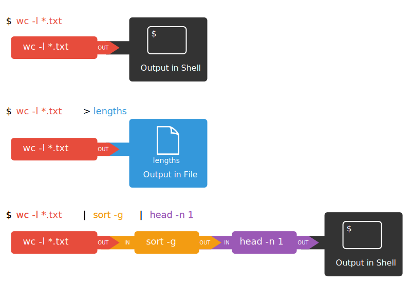

::::::::::::::::::::::::::::::::::::::: objectives

- Explain the advantage of linking commands with pipes and filters.
- Combine sequences of commands to get new output
- Redirect a command's output to a file.
- Explain what usually happens if a program or pipeline isn't given any input to process.

::::::::::::::::::::::::::::::::::::::::::::::::::

:::::::::::::::::::::::::::::::::::::::: questions

- How can I combine existing commands to produce a desired output?
- How can I show only part of the output? 

::::::::::::::::::::::::::::::::::::::::::::::::::

Now that we know a few basic commands,
we can finally look at the shell's most powerful feature:
the ease with which it lets us combine existing programs in new ways.
We'll start with the directory `shell-lesson-data/exercise-data/alkanes`
that contains six files describing some simple organic molecules.
The `.pdb` extension indicates that these files are in Protein Data Bank format,
a simple text format that specifies the type and position of each atom in the molecule.

```bash
$ ls
```

```output
cubane.pdb    methane.pdb    pentane.pdb
ethane.pdb    octane.pdb     propane.pdb
```

Let's run an example command:

```bash
$ wc cubane.pdb
```

```output
20  156 1158 cubane.pdb
```

`wc` is the 'word count' command:
it counts the number of lines, words, and characters in files (returning the values
in that order from left to right).

If we run the command `wc *.pdb`, the `*` in `*.pdb` matches zero or more characters,
so the shell turns `*.pdb` into a list of all `.pdb` files in the current directory:

```bash
$ wc *.pdb
```

```output
  20  156  1158  cubane.pdb
  12  84   622   ethane.pdb
   9  57   422   methane.pdb
  30  246  1828  octane.pdb
  21  165  1226  pentane.pdb
  15  111  825   propane.pdb
 107  819  6081  total
```

Note that `wc *.pdb` also shows the total number of all lines in the last line of the output.

If we run `wc -l` instead of just `wc`,
the output shows only the number of lines per file:

```bash
$ wc -l *.pdb
```

```output
  20  cubane.pdb
  12  ethane.pdb
   9  methane.pdb
  30  octane.pdb
  21  pentane.pdb
  15  propane.pdb
 107  total
```

The `-m` and `-w` options can also be used with the `wc` command to show
only the number of characters or the number of words, respectively.

:::::::::::::::::::::::::::::::::::::::::  callout

## Why Isn't It Doing Anything?

What happens if a command is supposed to process a file, but we
don't give it a filename? For example, what if we type:

```bash
$ wc -l
```

but don't type `*.pdb` (or anything else) after the command?
Since it doesn't have any filenames, `wc` assumes it is supposed to
process input given at the command prompt, so it just sits there and waits
for us to give it some data interactively. From the outside, though, all we
see is it sitting there, and the command doesn't appear to do anything.

If you make this kind of mistake, you can escape out of this state by
holding down the control key (<kbd>Ctrl</kbd>) and pressing the letter
<kbd>C</kbd> once: <kbd>Ctrl</kbd>\+<kbd>C</kbd>. Then release both keys.


::::::::::::::::::::::::::::::::::::::::::::::::::

## Capturing output from commands

Which of these files contains the fewest lines?
It's an easy question to answer when there are only six files,
but what if there were 6000?
Our first step toward a solution is to run the command:

```bash
$ wc -l *.pdb > lengths.txt
```

The greater than symbol, `>`, tells the shell to **redirect** the command's output to a
file instead of printing it to the screen. This command prints no screen output, because
everything that `wc` would have printed has gone into the file `lengths.txt` instead.
If the file doesn't exist prior to issuing the command, the shell will create the file.
If the file exists already, it will be silently overwritten, which may lead to data loss.
Thus, **redirect** commands require caution.

`ls lengths.txt` confirms that the file exists:

```bash
$ ls lengths.txt
```

```output
lengths.txt
```

We can now send the content of `lengths.txt` to the screen using `cat lengths.txt`.
The `cat` command gets its name from 'concatenate' i.e. join together,
and it prints the contents of files one after another.
There's only one file in this case,
so `cat` just shows us what it contains:

```bash
$ cat lengths.txt
```

```output
  20  cubane.pdb
  12  ethane.pdb
   9  methane.pdb
  30  octane.pdb
  21  pentane.pdb
  15  propane.pdb
 107  total
```

:::::::::::::::::::::::::::::::::::::::::  callout

## Output Page by Page

We'll continue to use `cat` in this lesson, for convenience and consistency,
but it has the disadvantage that it always dumps the whole file onto your screen.
More useful in practice is the command `less` (e.g. `less lengths.txt`).
This displays a screenful of the file, and then stops.
You can go forward one screenful by pressing the spacebar,
or back one by pressing `b`.  Press `q` to quit.


::::::::::::::::::::::::::::::::::::::::::::::::::

## Filtering output

Next we'll use the `sort` command to sort the contents of the `lengths.txt` file.
But first we'll do an exercise to learn a little about the sort command:

:::::::::::::::::::::::::::::::::::::::  challenge

## What Does `sort -n` Do?

The file `shell-lesson-data/exercise-data/numbers.txt` contains the following lines:

```source
10
2
19
22
6
```

If we run `sort` on this file, the output is:

```output
10
19
2
22
6
```

If we run `sort -n` on the same file, we get this instead:

```output
2
6
10
19
22
```

Explain why `-n` has this effect.

:::::::::::::::  solution

## Solution

The `-n` option specifies a numerical rather than an alphanumerical sort.


:::::::::::::::::::::::::

::::::::::::::::::::::::::::::::::::::::::::::::::

We will also use the `-n` option to specify that the sort is
numerical instead of alphanumerical.
This does *not* change the file;
instead, it sends the sorted result to the screen:

```bash
$ sort -n lengths.txt
```

```output
  9  methane.pdb
 12  ethane.pdb
 15  propane.pdb
 20  cubane.pdb
 21  pentane.pdb
 30  octane.pdb
107  total
```

We can put the sorted list of lines in another temporary file called `sorted-lengths.txt`
by putting `> sorted-lengths.txt` after the command,
just as we used `> lengths.txt` to put the output of `wc` into `lengths.txt`.
Once we've done that,
we can run another command called `head` to get the first few lines in `sorted-lengths.txt`:

```bash
$ sort -n lengths.txt > sorted-lengths.txt
$ head -n 1 sorted-lengths.txt
```

```output
  9  methane.pdb
```

Using `-n 1` with `head` tells it that
we only want the first line of the file;
`-n 20` would get the first 20,
and so on.
Since `sorted-lengths.txt` contains the lengths of our files ordered from least to greatest,
the output of `head` must be the file with the fewest lines.

:::::::::::::::::::::::::::::::::::::::::  callout

## Redirecting to the same file

It's a very bad idea to try redirecting
the output of a command that operates on a file
to the same file. For example:

```bash
$ sort -n lengths.txt > lengths.txt
```

Doing something like this may give you
incorrect results and/or delete
the contents of `lengths.txt`.


::::::::::::::::::::::::::::::::::::::::::::::::::

:::::::::::::::::::::::::::::::::::::::  challenge

## What Does `>>` Mean?

We have seen the use of `>`, but there is a similar operator `>>`
which works slightly differently.
We'll learn about the differences between these two operators by printing some strings.
We can use the `echo` command to print strings e.g.

```bash
$ echo The echo command prints text
```

```output
The echo command prints text
```

Now test the commands below to reveal the difference between the two operators:

```bash
$ echo hello > testfile01.txt
```

and:

```bash
$ echo hello >> testfile02.txt
```

Hint: Try executing each command twice in a row and then examining the output files.

:::::::::::::::  solution

## Solution

In the first example with `>`, the string 'hello' is written to `testfile01.txt`,
but the file gets overwritten each time we run the command.

We see from the second example that the `>>` operator also writes 'hello' to a file
(in this case `testfile02.txt`),
but appends the string to the file if it already exists
(i.e. when we run it for the second time).


:::::::::::::::::::::::::

::::::::::::::::::::::::::::::::::::::::::::::::::

:::::::::::::::::::::::::::::::::::::::  challenge

## Appending Data

We have already met the `head` command, which prints lines from the start of a file.
`tail` is similar, but prints lines from the end of a file instead.

Consider the file `shell-lesson-data/exercise-data/animal-counts/animals.csv`.
After these commands, select the answer that
corresponds to the file `animals-subset.csv`:

```bash
$ head -n 3 animals.csv > animals-subset.csv
$ tail -n 2 animals.csv >> animals-subset.csv
```

1. The first three lines of `animals.csv`
2. The last two lines of `animals.csv`
3. The first three lines and the last two lines of `animals.csv`
4. The second and third lines of `animals.csv`

:::::::::::::::  solution

## Solution

Option 3 is correct.
For option 1 to be correct we would only run the `head` command.
For option 2 to be correct we would only run the `tail` command.
For option 4 to be correct we would have to pipe the output of `head` into `tail -n 2`
by doing `head -n 3 animals.csv | tail -n 2 > animals-subset.csv`


:::::::::::::::::::::::::

::::::::::::::::::::::::::::::::::::::::::::::::::

## Passing output to another command

In our example of finding the file with the fewest lines,
we are using two intermediate files `lengths.txt` and `sorted-lengths.txt` to store output.
This is a confusing way to work because
even once you understand what `wc`, `sort`, and `head` do,
those intermediate files make it hard to follow what's going on.
We can make it easier to understand by running `sort` and `head` together:

```bash
$ sort -n lengths.txt | head -n 1
```

```output
  9  methane.pdb
```

The vertical bar, `|`, between the two commands is called a **pipe**.
It tells the shell that we want to use
the output of the command on the left
as the input to the command on the right.

This has removed the need for the `sorted-lengths.txt` file.

## Combining multiple commands

Nothing prevents us from chaining pipes consecutively.
We can for example send the output of `wc` directly to `sort`,
and then send the resulting output to `head`.
This removes the need for any intermediate files.

We'll start by using a pipe to send the output of `wc` to `sort`:

```bash
$ wc -l *.pdb | sort -n
```

```output
   9 methane.pdb
  12 ethane.pdb
  15 propane.pdb
  20 cubane.pdb
  21 pentane.pdb
  30 octane.pdb
 107 total
```

We can then send that output through another pipe, to `head`, so that the full pipeline becomes:

```bash
$ wc -l *.pdb | sort -n | head -n 1
```

```output
   9  methane.pdb
```

This is exactly like a mathematician nesting functions like *log(3x)*
and saying 'the log of three times *x*'.
In our case,
the algorithm is 'head of sort of line count of `*.pdb`'.

The redirection and pipes used in the last few commands are illustrated below:

{alt='Redirects and Pipes of different commands: "wc -l \*.pdb" will direct theoutput to the shell. "wc -l \*.pdb > lengths" will direct output to the file"lengths". "wc -l \*.pdb | sort -n | head -n 1" will build a pipeline where theoutput of the "wc" command is the input to the "sort" command, the output ofthe "sort" command is the input to the "head" command and the output of the"head" command is directed to the shell'}

:::::::::::::::::::::::::::::::::::::::  challenge

## Piping Commands Together

In our current directory, we want to find the 3 files which have the least number of
lines. Which command listed below would work?

1. `wc -l * > sort -n > head -n 3`
2. `wc -l * | sort -n | head -n 1-3`
3. `wc -l * | head -n 3 | sort -n`
4. `wc -l * | sort -n | head -n 3`

:::::::::::::::  solution

## Solution

Option 4 is the solution.
The pipe character `|` is used to connect the output from one command to
the input of another.
`>` is used to redirect standard output to a file.
Try it in the `shell-lesson-data/exercise-data/alkanes` directory!


:::::::::::::::::::::::::

::::::::::::::::::::::::::::::::::::::::::::::::::

## Tools designed to work together

This idea of linking programs together is why Unix has been so successful.
Instead of creating enormous programs that try to do many different things,
Unix programmers focus on creating lots of simple tools that each do one job well,
and that work well with each other.
This programming model is called 'pipes and filters'.
We've already seen pipes;
a **filter** is a program like `wc` or `sort`
that transforms a stream of input into a stream of output.
Almost all of the standard Unix tools can work this way.
Unless told to do otherwise,
they read from standard input,
do something with what they've read,
and write to standard output.

The key is that any program that reads lines of text from standard input
and writes lines of text to standard output
can be combined with every other program that behaves this way as well.
You can *and should* write your programs this way
so that you and other people can put those programs into pipes to multiply their power.

:::::::::::::::::::::::::::::::::::::::  challenge

## Pipe Reading Comprehension

A file called `animals.csv` (in the `shell-lesson-data/exercise-data/animal-counts` folder)
contains the following data:

```source
2012-11-05,deer,5
2012-11-05,rabbit,22
2012-11-05,raccoon,7
2012-11-06,rabbit,19
2012-11-06,deer,2
2012-11-06,fox,4
2012-11-07,rabbit,16
2012-11-07,bear,1
```

What text passes through each of the pipes and the final redirect in the pipeline below?
Note, the `sort -r` command sorts in reverse order.

```bash
$ cat animals.csv | head -n 5 | tail -n 3 | sort -r > final.txt
```

Hint: build the pipeline up one command at a time to test your understanding

:::::::::::::::  solution

## Solution

The `head` command extracts the first 5 lines from `animals.csv`.
Then, the last 3 lines are extracted from the previous 5 by using the `tail` command.
With the `sort -r` command those 3 lines are sorted in reverse order.
Finally, the output is redirected to a file: `final.txt`.
The content of this file can be checked by executing `cat final.txt`.
The file should contain the following lines:

```source
2012-11-06,rabbit,19
2012-11-06,deer,2
2012-11-05,raccoon,7
```

:::::::::::::::::::::::::

::::::::::::::::::::::::::::::::::::::::::::::::::

:::::::::::::::::::::::::::::::::::::::  challenge

## Pipe Construction

For the file `animals.csv` from the previous exercise, consider the following command:

```bash
$ cut -d , -f 2 animals.csv
```

The `cut` command is used to remove or 'cut out' certain sections of each line in the file,
and `cut` expects the lines to be separated into columns by a <kbd>Tab</kbd> character.
A character used in this way is called a **delimiter**.
In the example above we use the `-d` option to specify the comma as our delimiter character.
We have also used the `-f` option to specify that we want to extract the second field (column).
This gives the following output:

```output
deer
rabbit
raccoon
rabbit
deer
fox
rabbit
bear
```

The `uniq` command filters out adjacent matching lines in a file.
How could you extend this pipeline (using `uniq` and another command) to find
out what animals the file contains (without any duplicates in their
names)?

:::::::::::::::  solution

## Solution

```bash
$ cut -d , -f 2 animals.csv | sort | uniq
```

:::::::::::::::::::::::::

::::::::::::::::::::::::::::::::::::::::::::::::::

:::::::::::::::::::::::::::::::::::::::  challenge

## Which Pipe?

The file `animals.csv` contains 8 lines of data formatted as follows:

```output
2012-11-05,deer,5
2012-11-05,rabbit,22
2012-11-05,raccoon,7
2012-11-06,rabbit,19
...
```

The `uniq` command has a `-c` option which gives a count of the
number of times a line occurs in its input.  Assuming your current
directory is `shell-lesson-data/exercise-data/animal-counts`,
what command would you use to produce a table that shows
the total count of each type of animal in the file?

1. `sort animals.csv | uniq -c`
2. `sort -t, -k2,2 animals.csv | uniq -c`
3. `cut -d, -f 2 animals.csv | uniq -c`
4. `cut -d, -f 2 animals.csv | sort | uniq -c`
5. `cut -d, -f 2 animals.csv | sort | uniq -c | wc -l`

:::::::::::::::  solution

## Solution

Option 4 is the correct answer.
If you have difficulty understanding why, try running the commands, or sub-sections of
the pipelines (make sure you are in the `shell-lesson-data/exercise-data/animal-counts`
directory).


:::::::::::::::::::::::::

::::::::::::::::::::::::::::::::::::::::::::::::::

## Nelle's Pipeline: Checking Files

Nelle has run her samples through the assay machines
and created 17 files in the `north-pacific-gyre` directory described earlier.
As a quick check, starting from the `shell-lesson-data` directory, Nelle types:

```bash
$ cd north-pacific-gyre
$ wc -l *.txt
```

The output is 18 lines that look like this:

```output
300 NENE01729A.txt
300 NENE01729B.txt
300 NENE01736A.txt
300 NENE01751A.txt
300 NENE01751B.txt
300 NENE01812A.txt
... ...
```

Now she types this:

```bash
$ wc -l *.txt | sort -n | head -n 5
```

```output
 240 NENE02018B.txt
 300 NENE01729A.txt
 300 NENE01729B.txt
 300 NENE01736A.txt
 300 NENE01751A.txt
```

Whoops: one of the files is 60 lines shorter than the others.
When she goes back and checks it,
she sees that she did that assay at 8:00 on a Monday morning --- someone
was probably in using the machine on the weekend,
and she forgot to reset it.
Before re-running that sample,
she checks to see if any files have too much data:

```bash
$ wc -l *.txt | sort -n | tail -n 5
```

```output
 300 NENE02040B.txt
 300 NENE02040Z.txt
 300 NENE02043A.txt
 300 NENE02043B.txt
5040 total
```

Those numbers look good --- but what's that 'Z' doing there in the third-to-last line?
All of her samples should be marked 'A' or 'B';
by convention,
her lab uses 'Z' to indicate samples with missing information.
To find others like it, she does this:

```bash
$ ls *Z.txt
```

```output
NENE01971Z.txt    NENE02040Z.txt
```

Sure enough,
when she checks the log on her laptop,
there's no depth recorded for either of those samples.
Since it's too late to get the information any other way,
she must exclude those two files from her analysis.
She could delete them using `rm`,
but there are actually some analyses she might do later where depth doesn't matter,
so instead, she'll have to be careful later on to select files using the wildcard expressions
`NENE*A.txt NENE*B.txt`.

:::::::::::::::::::::::::::::::::::::::  challenge

## Removing Unneeded Files

Suppose you want to delete your processed data files, and only keep
your raw files and processing script to save storage.
The raw files end in `.dat` and the processed files end in `.txt`.
Which of the following would remove all the processed data files,
and *only* the processed data files?

1. `rm ?.txt`
2. `rm *.txt`
3. `rm * .txt`
4. `rm *.*`

:::::::::::::::  solution

## Solution

1. This would remove `.txt` files with one-character names
2. This is the correct answer
3. The shell would expand `*` to match everything in the current directory,
  so the command would try to remove all matched files and an additional
  file called `.txt`
4. The shell expands `*.*` to match all filenames containing at least one
  `.`, including the processed files (`.txt`) *and* raw files (`.dat`)
  
  

:::::::::::::::::::::::::

::::::::::::::::::::::::::::::::::::::::::::::::::


:::::::::::::::::::::::::::::::::::::::: keypoints

- `wc` counts lines, words, and characters in its inputs.
- `cat` displays the contents of its inputs.
- `sort` sorts its inputs.
- `head` displays the first 10 lines of its input by default without additional arguments.
- `tail` displays the last 10 lines of its input by default without additional arguments.
- `command > [file]` redirects a command's output to a file (overwriting any existing content).
- `command >> [file]` appends a command's output to a file.
- `[first] | [second]` is a pipeline: the output of the first command is used as the input to the second.
- The best way to use the shell is to use pipes to combine simple single-purpose programs (filters).

::::::::::::::::::::::::::::::::::::::::::::::::::


